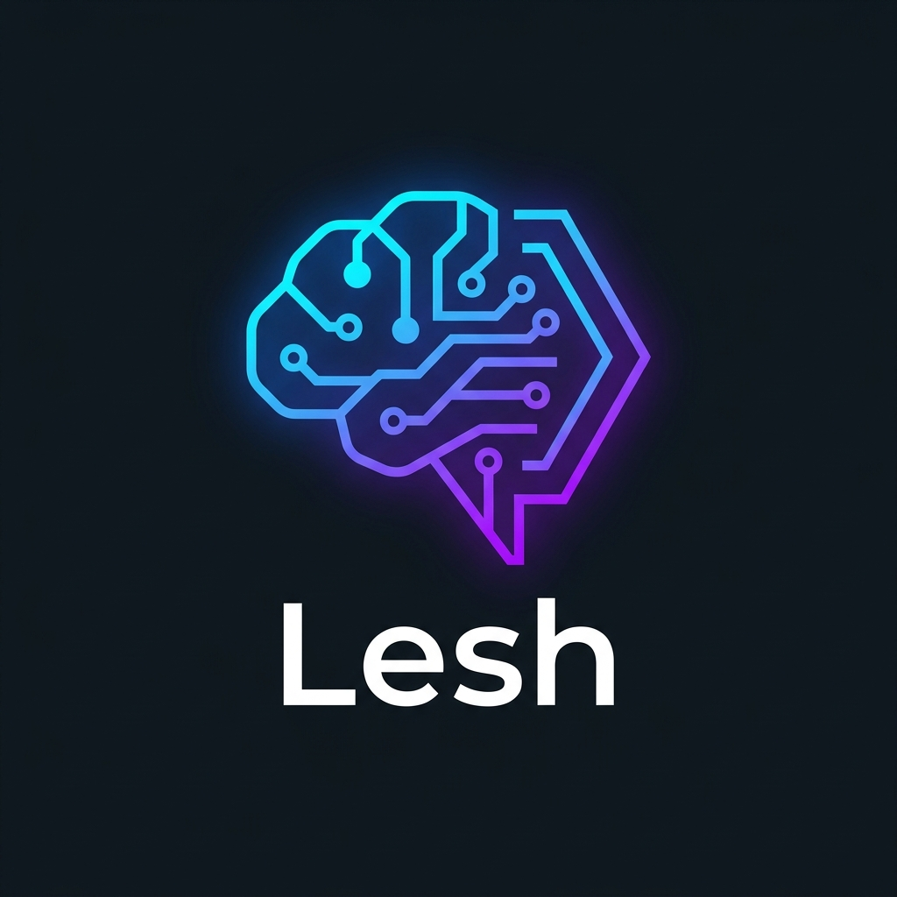

<p align="center">
  
</p>

# Lesh - Local Agent Coder

Lesh is an advanced, autonomous AI coding agent designed to run primarily locally, ensuring total privacy and control over your data. With its powerful self-updating mechanism and elegant Material Design 3 interface, Lesh streamlines your coding workflow and acts as your personalized AI pair programmer.

## Features

- 🌍 **Bilingual Support (EN / TR)**: Easily switch between English and Turkish UI from the top menu.
- 💬 **Persistent Chat Sessions**: Your past chat sessions are automatically saved in the `.lesh/sessions/` directory. You can easily access, review, and continue from any past chat using the sidebar.
- ⚡ **Auto-Updating System**: On every startup, Lesh checks for a new version via the GitHub API, downloads the zip payload silently, replaces the old files, and restarts itself without any manual intervention. 
- 🤖 **Multi-LLM Capabilities**:
  - **Local (Ollama)**: True privacy. Supports `qwen2.5-coder`, `deepseek-r1` and more.
  - **Cloud Providers**: Seamlessly switch to GitHub Models, Google AI Studio (Gemini), or Groq Cloud via PATs/API keys to access state-of-the-art models like `gpt-4o`, `gemini-2.0-flash`, and `llama-3.3-70b`.
- 🔐 **Cloud Accounts (Supabase)**: Securely log in and save your API keys (GitHub, Groq, etc.) to the cloud. Your keys are encrypted locally before transmission and synced across your devices via Supabase Row Level Security (RLS).
- 📁 **Workspace Management**: Bind a folder to the agent. It will read files, execute commands, run code, and seamlessly git commit & push its own autonomous changes.
- 📦 **One-Dir Architecture**: Packaged as a single directory executable (`--onedir`), keeping it completely open-source and transparent for you to inspect and modify.

## Quick Start

1. Download the latest `lesh-agent.zip` (Lesh Agent) from the [Releases](../../releases) tab.
2. Extract the folder to a desired location on your computer.
3. Run `lesh-agent.exe`.
4. Click **Select Workspace** to bind a project folder.
5. (Optional) Enter your API tokens for cloud providers or select `Yerel (Ollama)` to run completely locally.
6. Start coding!

## Developer Setup

If you want to run the python code directly or build the application yourself:

```bash
git clone https://github.com/Xbygone/lesh-agent.git
cd lesh-agent
pip install -r requirements.txt
python main.py
```

### Auto-Release

To create a new release executable and push it to GitHub:
```bash
python release.py 1.0.4 YOUR_GITHUB_PAT
```

This will increment the internal version, build with PyInstaller, zip the dist folder, and upload the payload directly to GitHub releases.

## License

Open Source. Developed with 💙 by the Lesh Community.
